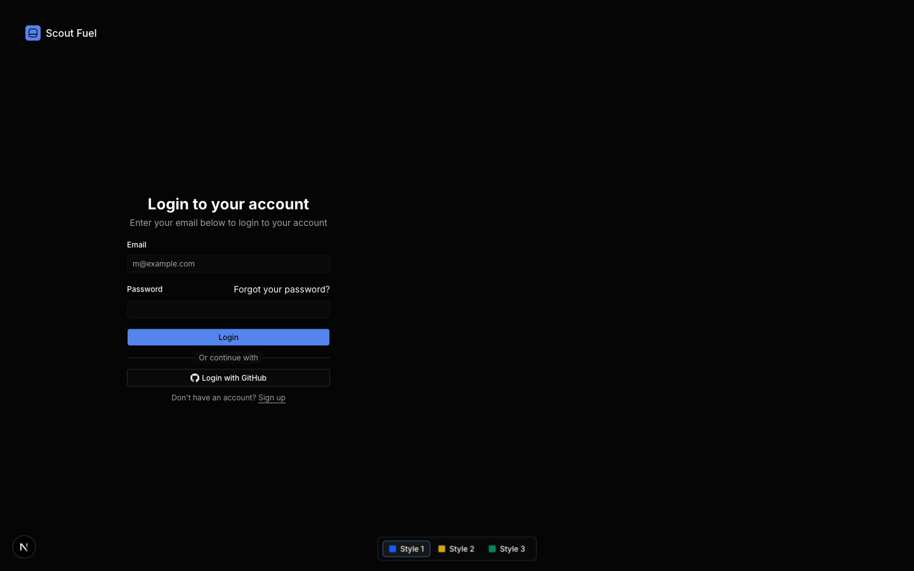
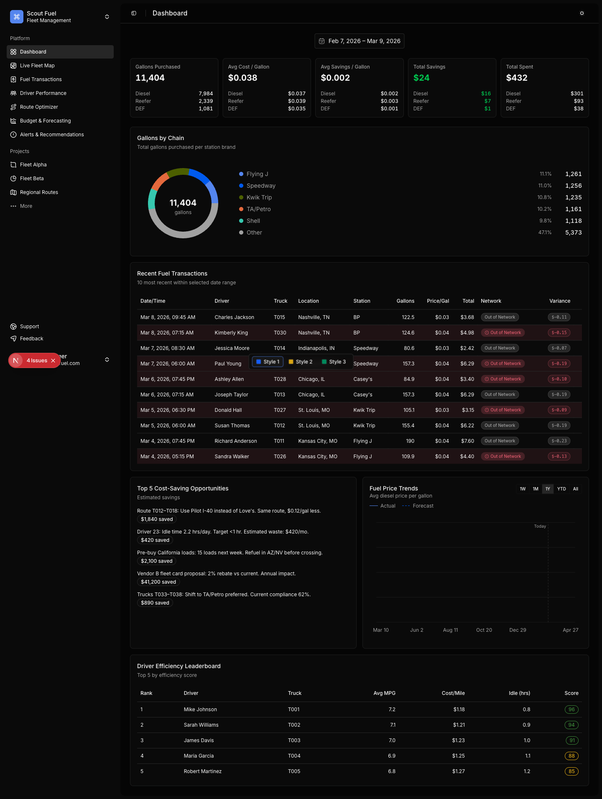
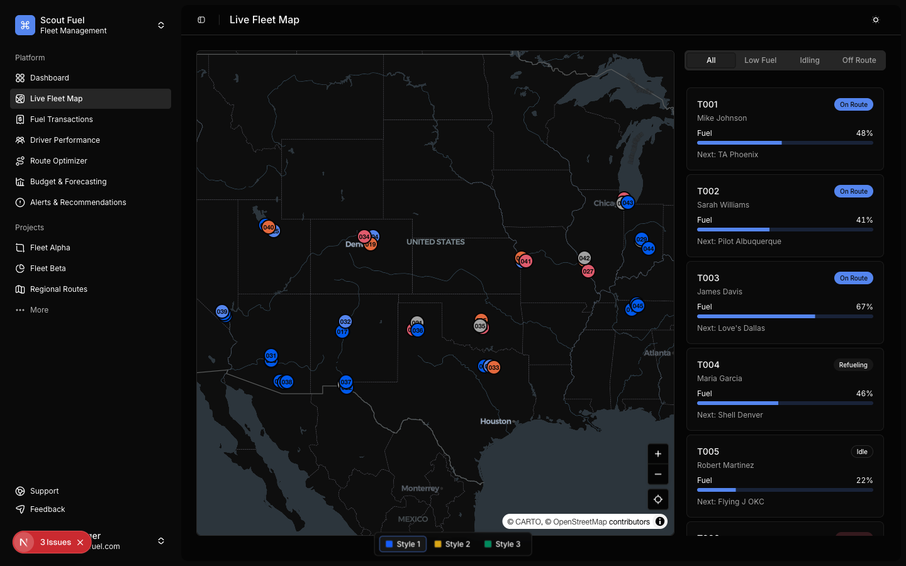
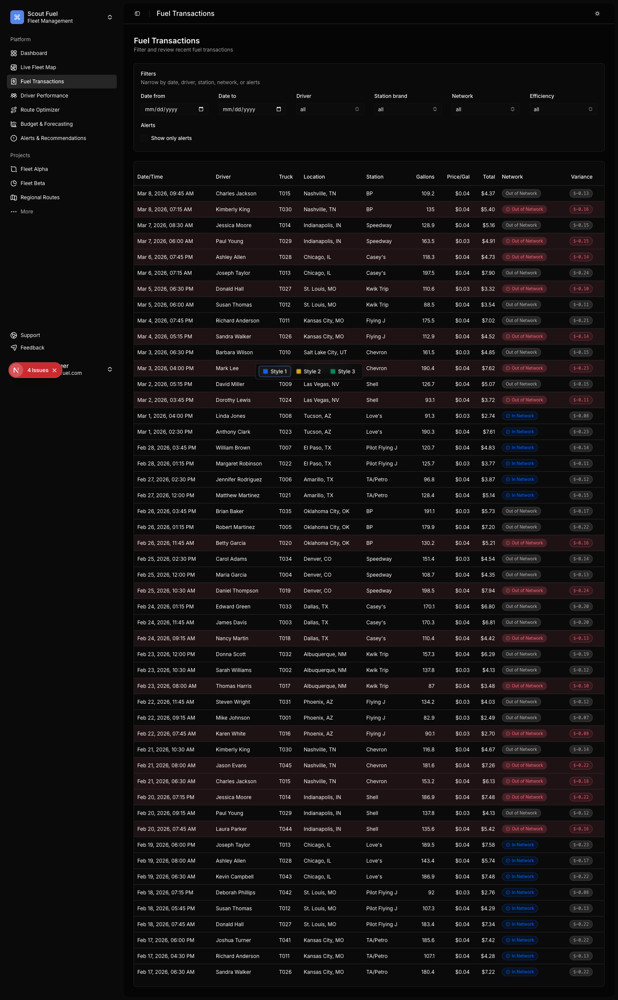
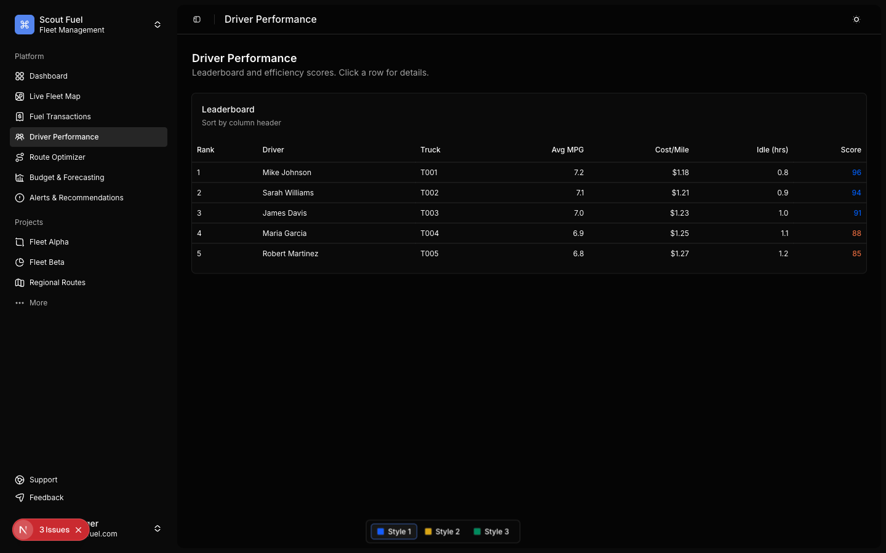
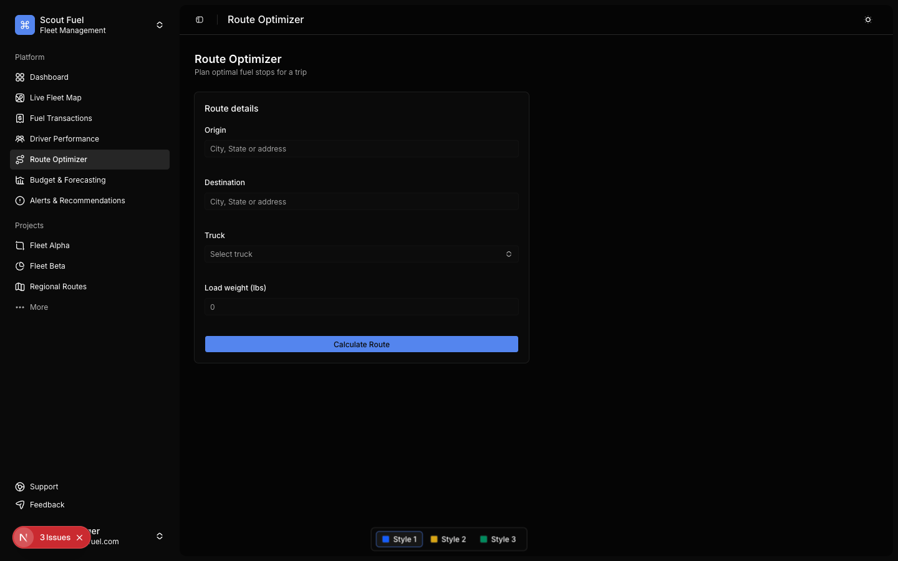
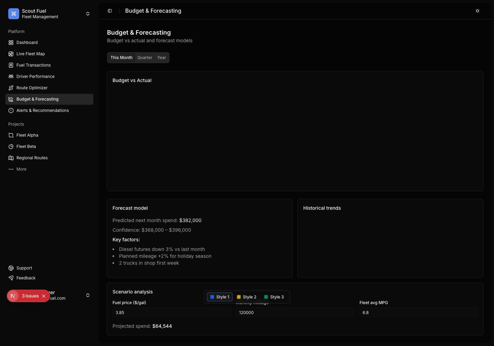
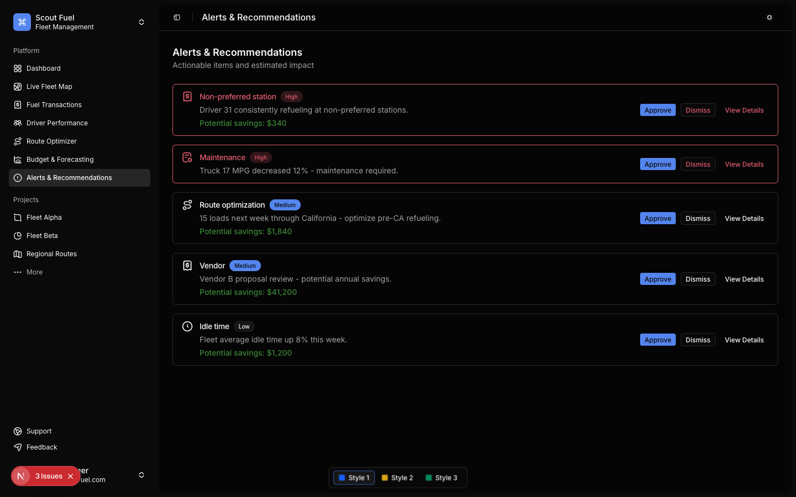

# Scout Fuel — Work Summary

**Date:** March 9, 2026  
**For:** Client review

---

## What We Built

Scout Fuel is a **fleet fuel management dashboard** — a web app that gives fleet managers a single place to see fuel usage, costs, driver performance, and recommendations. We set up the project from the ground up and built the first full set of screens so you can see how the product will look and behave.

**Choices we made (and why they matter):**

We chose **Tailwind CSS** for styling. Tailwind is a utility-first CSS framework: instead of writing custom CSS for every button or layout, we use small, reusable classes that do one thing (e.g. “this text is bold,” “this box has padding”). The benefit for you: the app stays **consistent**, **fast to load**, and **easy to change** later. New features can match the existing look without starting from scratch, and the codebase stays maintainable as the product grows.

We chose **shadcn/ui** for the interface components. shadcn is a set of open-source, accessible building blocks (buttons, forms, tables, charts, sidebars, etc.) that we copy into the project and own. They’re not a black box: we can tweak every part to match your brand and UX. The benefits: **professional, accessible UI** out of the box, **full control** over design and behavior, and **no ongoing licensing or lock-in** — it’s your code.

On top of that we added **three switchable style themes** (blue/violet, warm/amber, teal/green) so the same dashboard can be previewed in different palettes. The app also supports **light and dark mode** and a **collapsible sidebar** so the layout works on different screen sizes.

---

## What's New

- **Project foundation** — Next.js app with Tailwind CSS and shadcn/ui; responsive layout with sidebar and header.
- **Login** — Dedicated login screen with a simple form and branding area, ready to be wired to your auth.
- **Dashboard (home)** — Main view with KPIs (gallons, spend, savings), fuel price trends chart, recent transactions table, cost-saving opportunities, and driver leaderboard. Date range and fuel-type toggles.
- **Live Fleet Map** — Map view for fleet locations (MapLibre/Leaflet), ready for real-time or sample data.
- **Fuel Transactions** — Filterable, sortable table of fuel transactions with driver, date, location, and cost.
- **Driver Performance** — Driver-level metrics (e.g. MPG, cost per mile) with charts and comparison.
- **Route Optimizer** — Screen for route planning and optimization inputs.
- **Budget & Forecasting** — Budget vs actual views with bar charts by category/time.
- **Alerts & Recommendations** — Placeholder for alerts and actionable recommendations.
- **Style switcher** — Three theme variants (Style 1, 2, 3) plus light/dark mode, with styles stored so the choice persists.

---

## Why It Matters

You get a **single, coherent product** instead of a patchwork of screens. Fleet managers can move from login to dashboard to transactions to drivers to budget without leaving one app. The choices we made (Tailwind + shadcn) mean the UI is **consistent**, **accessible**, and **easy to evolve** — so when you add real data, new roles, or new features, the foundation is already in place. The themes and dark mode show that the product can adapt to different brands and user preferences without a redesign.

---

## How It Follows Best Practices

- **Visual hierarchy and consistency** — Headings, cards, and tables use a clear structure and shared design tokens so the most important information stands out and the app feels like one product (UX consistency).
- **Recognition over recall** — Navigation is always visible in the sidebar with clear labels (Dashboard, Live Fleet Map, Fuel Transactions, etc.), so users don’t have to remember where things are.
- **Accessibility** — We use shadcn components built with accessibility in mind (keyboard navigation, focus states, semantic structure), which supports WCAG-oriented design and better experience for all users.
- **Responsive layout** — The sidebar collapses to icons on smaller widths, and the layout is built to work across desktop and tablet; the login page uses a two-column layout that stacks on small screens.
- **Performance** — Next.js and Tailwind support code splitting and lean CSS so the app can stay fast as we add more screens and data.

---

## Screenshots

Below are captures of the main screens as they look today. You can use these to see the value of the work at a glance.

**Login**  
  
*Simple login screen with branding and form, ready to connect to your authentication.*

**Dashboard (home)**  
  
*Main dashboard with KPIs, fuel price trends, transactions, cost opportunities, and driver leaderboard.*

**Live Fleet Map**  
  
*Map view for fleet locations and routes.*

**Fuel Transactions**  
  
*Filterable and sortable fuel transaction list.*

**Driver Performance**  
  
*Driver-level metrics and comparison.*

**Route Optimizer**  
  
*Route planning and optimization.*

**Budget & Forecasting**  
  
*Budget vs actual with charts.*

**Alerts & Recommendations**  
  
*Alerts and recommendations screen.*

---

## Next Steps

- Connect login to your authentication provider.
- Plug in real data sources for transactions, drivers, and fleet locations.
- Add any role-based views or permissions you need.
- Refine copy, labels, and any branding (logo, colors) to match your final product.
